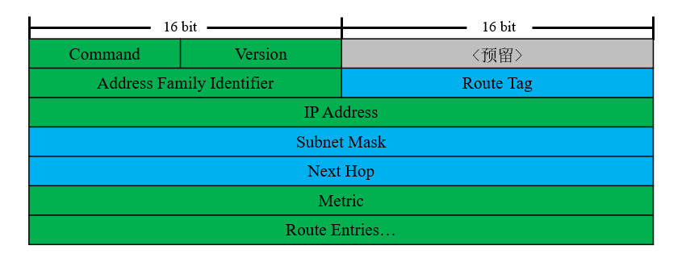

# 概述
路由信息协议(Routing Information Protocol, RIP)是IGP中最早得到广泛应用的路由协议。

RIP协议基于贝尔曼-福特(Bellman-Ford)算法实现，这种算法属于距离矢量算法，它在带宽、性能和管理方面的要求较低；与此同时，RIP协议直接传递路由信息，收敛速度较慢、可靠性较低，因此主要适用于规模较小的网络或实验室。

RIP目前拥有两个版本，它们支持的特性如下表所示：

|   特性   | RIPv1 |      RIPv2      |
| :------: | :---: | :-------------: |
|   VLSM   |   ❎   |        ✅        |
|   CIDR   |   ❎   | 仅支持路由汇总  |
| 更新方式 | 广播  | 组播(224.0.0.9) |
| 自动汇总 | 强制  |      可选       |
| 手工汇总 |   ❎   |        ✅        |
| 路由标记 |   ❎   |        ✅        |
| 报文认证 |   ❎   |        ✅        |

# 报文结构
RIP协议的报文封装在UDP协议中，使用520端口进行通信。

每条RIP消息包含两个部分，分别为Header和Route Entries。Header部分包含控制信息；Route Entries部分最多携带25个路由条目。

- 绿色表示该字段在RIPv1与RIPv2中含义相同。
- 蓝色表示该字段在RIPv2中为新增字段。
- 灰色表示该字段目前暂未使用。

🔷 Command

报文类型，长度2字节。

请求报文取值为"1"，更新报文取值为"2"。

🔷 Version

协议版本，长度2字节。

取值为协议的版本号。

🔷 Address Family Identifier

被路由协议类型标识，长度4字节。

IPv4中取值为"2"；当请求所有路由信息时，该字段取值为"0"。

🔷 Route Tag

路由标记，长度2字节。

用于标记重发布到RIPv2管理域中的路由条目。

🔷 IP Address

路由信息的目的地址。

🔷 Subnet Mask

路由信息的子网掩码。

🔷 Next Hop

更优的下一跳地址。

当路由器发现某条路由的下一跳地址与自身在同一广播域内时，就会使用该字段将更优下一跳告知其它邻居。

🔷 Metric

跳步计数，长度4字节。

到达目的网络的跳步计数，路由器收到路由信息后，会将跳数+1后再发送给其他邻居。

# 报文类型
## 请求(Request)
仅在RIP进程刚启动时发送，用于向路由器周围运行RIP协议的节点请求路由条目。

## 更新(Update)
用于更新路由信息，一个更新报文最多包含25条路由，超过此数量则分为多个报文发送，启用认证功能后最大数量变更为24条。

# 计时器
## 更新计时器(Updata Timer)
默认每隔30秒从所有被宣告的接口发送更新报文。
 失效计时器(Invalidation Timer)
一条新的路由条目建立后，失效计时器初始化为180秒，当这条路由再次被更新时，失效计时器又将被重置为180秒。若路由条目在180秒内一直没有被更新，那么这条路由的跳数将被标记为16跳，也就是被标记为不可达。
 抑制计时器(Holddown Timer)
对于某条路由条目，如果某次更新中从别的路由器接收到该条目，并且该条目度量值凭空增大了，则路由器不会直接更新路由表，而是将已有的条目标记为不可达并开启抑制计时器。如果在180秒期间一直收到同样度量值的路由，那么180秒后，才会在路由表中更新该条目；否则，将无视该路由更新。
 刷新计时器(Flush Timer)
这个计时器设置的时间一般比失效计时器长60秒。若某路由条目的刷新计时器也超时了，其将被通告为不可到达，并且本地路由器将删除该条目。
 更改计时器数值
Cisco(config-router)#timers basic [Update] [Invalid] [Holddown] [Flush]

# 度量值
RIP协议使用跃点数(Hop)作为度量值，通告者将本地路由条目的度量值+1后发送，最大跳数为15跳，16跳表示网络已不可达。

因为跳数仅表示到达目的网段需要经过的节点数量，对链路的带宽、时延等因素并无考虑，可能导致数据包被发到跳数较小但带宽窄、时延大的链路上。

# 异步更新
路由收敛完成后，管理域内路由器发送更新报文的时间将趋于一致，这会导致网络间歇性的拥塞，影响用户体验。

RIP使用弹性计时器控制更新报文间隔，该计时器可选取[-4.75,4.75]内的随机值，使得更新报文间隔不一定是30秒。

# 防环机制
 定义最大跳数
由于距离矢量协议的特性，错误的路由条目将被无条件信任。RIP协议定义了最大度量值，错误的信息传递一定时间后将达到最大度量值，接收方将会删除该条目，发送方的失效计时器到期后也将其删除，从而阻断环路。
 水平分割(Splithorizon)
从一个接口学习到的路由条目不会再从该接口发送，该特性默认启用。
 开启/关闭水平分割
Cisco(config-if)#{no} ip split-horizon
 毒性逆转(Poison Reverse)
水平分割机制的增强版。当某节点的直连网络失效时，邻居路由表尚未刷新，邻居将会发送到达本地直连网段的更新报文，此时本节点会将该路由度量值设为16并发送回去。
 路由毒化(Route Posion)
当节点检测到某路由条目失效后，会将其跳数设置为16并向邻居传播。
 触发更新(Trigger Update)
一旦检测到拓扑变化，立即发送更新报文而不用等待更新计时器超时。

1.2.11  引入默认路由
 方法一
出口路由器运行RIP协议时，可以配置默认路由，并重分布静态路由进入RIP进程。
Cisco(config-router)#redistribute static metric [度量值]
 方法二
出口路由器配置默认路由（只关联出站接口），然后宣告默认路由进入RIP进程。
Cisco(config-router)#network 0.0.0.0
 方法三
在RIP域边界路由器上定义去往外网的默认网络，此方法为距离矢量协议通用方法。
Cisco(config)#ip default-network [默认网络ID]
 方法四
将RIP域边界路由器设置为“默认网络起源”，其会下发默认路由到RIP域中。
Cisco(config-router)#default-information originate
1.2.12  路由汇总
 自动汇总
自动汇总功能默认开启，并且在RIPv1中无法关闭。启用自动汇总时，RIP路由器可以对本地路由和邻居宣告的路由进行汇总。自动汇总的优先级高于手动汇总，在不连续子网环境中会造成路由黑洞，建议关闭该特性。
 开启/关闭自动汇总
Cisco(config-router)#{no} auto-summary
 手动汇总
RIP协议不完全支持CIDR，只能汇总到主类网络边界，无法汇总到主类边界之外。虽然RIP自身不能完全汇总，但可以传递CIDR路由，因此可以使用静态路由发布汇总后的条目，然后重分布进RIP进程中。
如果多条明细路由的度量值不同，则将取最小的一条作为汇总路由的度量值，所有明细路由均不可达时汇总路由才会消失。
 进行手工汇总
Cisco(config-if)#ip summary-address rip [汇总网络ID] [汇总子网掩码]
1.2.13  偏移列表
偏移列表(Offset List)可以调用ACL抓取某些路由，增加其度量值，然后将该路由发送。发送方向和接收方向均可使用偏移列表；如果没有调用ACL且没有调用接口，路由器将会修改所有接口收到的RIP路由度量值。
 使用偏移列表
Cisco(config-router)#offset-list [ACL序号] {in|out} [度量值增量] [接口ID]
1.2.14  被动接口
被动接口只能发送单播更新报文，不能通过组播或广播方式发送更新报文，因此需要手动指定邻居。被动接口仍然可以接收组播和广播更新报文。
 手动指定邻居
Cisco(config-router)#neighbor [邻居IP地址]
 设置被动接口
Cisco(config-router)#passive-interface [端口ID]
1.2.15  纯触发更新
启用该特性后，两端设备不再发送周期性的更新报文，仅当路由表发生变化时发送更新报文。该特性仅可用于点到点链路，且链路两端均需要启用。
建议在广域网链路启用该特性，以节约链路带宽。
Cisco(config-if)#ip rip triggered
1.2.16  兼容性调整
为了兼容早期设备，RIP协议有一系列参数可供调整。
 调整接口发送/接收报文的版本
Cisco(config-if)#ip rip [receive|send} version [1|2]
 使用广播方式发送RIPv2报文
Cisco(config-if)#{no} ip rip v2-broadcast
RIP协议可以修改多个报文的发送间隔，防止性能较差的设备接收缓冲区溢出。
 修改连续报文发送延时
Cisco(config-router)#output-delay [毫秒]
1.2.17  认证
RIPv2支持对协议报文进行认证，认证方式有明文认证和MD5认证两种。当配置认证功能时，设备会对报文中的第一条Route Entries进行修改，具体修改如下：
 Address Family Identity字段改为0xFFFF。
 Route Tag字段改为Authentication Type字段。
 IP Address、Subnet Mask、Next Hop和Metric改为口令字段。
 配置步骤
1.创建钥匙链。
  Cisco(config)#key chain [钥匙链名称]
  Cisco(config-keychain)#key [密钥序号]
  Cisco(config-keychain-key)#key-string [密码字符串]
2.选择认证类型。
  Cisco(config-if)#ip rip authentication mode [text|md5]
3.应用钥匙链。
  Cisco(config-if)#ip rip authentication key-chain [钥匙链名称]
钥匙链名称仅本地有效，密钥序号需保持两端一致。
1.2.18  更新源检测
路由器收到更新报文时检查源地址和传入接口地址是否处于同一子网，若不匹配则丢弃该报文。此规则默认启用，仅在特殊的实验环境中需要关闭。
 打开/关闭更新源检测
Cisco(config-router)#{no} validate-update-source
 

1.2.10  相关配置
 基本配置
 创建RIP进程
Cisco(config)#router rip
RIP协议不支持多进程，每台设备只能创建一个RIP进程。
 向RIP中宣告网段
Cisco(config-router)#network [主类网络ID]
 参数调整
 切换RIP协议版本
Cisco(config-router)#version [1|2]