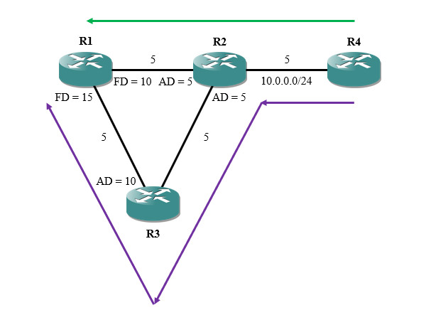

# 概述
增强型内部网关路由协议(Enhanced Interior Gateway Routing Protocol, EIGRP)是Cisco开发的私有路由协议。EIGRP结合了距离矢量协议和链路状态协议的特点，采用弥散更新算法(DUAL)来实现快速收敛，可以不必定期发送路由更新报文，以此减少带宽的占用。

EIGRP使用单播和组播（组播地址：224.0.0.10）方式发送协议报文，其兼容模块可以同时支持IP、Appletalk、Novell和NetWare等多种网络层协议。

EIGRP具有以下特点：

- EIGRP是无类协议，支持VLSM和CIDR。
- EIGRP能路由多种网络层协议，最大可支持100跳的网络。
- EIGRP的机制使其绝对不会产生环路。
- EIGRP使用增量更新，带宽占用少。
- EIGRP可以支持等价、非等价负载均衡。

# 术语
## EIGRP进程
EIGRP用AS号来区分不同的进程，取值范围为 `[0, 65535]` ，这个AS号并不是真正意义上的自治系统号，只是用于区分不同的进程。

每个EIGRP进程只能路由一种网络层协议，并且两个路由器必须持有相同的AS号才能建立邻居关系。

## 通告距离(Advertised Distance, AD)
通告距离，是指邻居路由器通告的到达某个网段的度量值。

## 可行距离(Feasible Distance, FD)
可行距离，是指本地路由器到达某个网段的度量值。

$$
FD=AD+自己到邻居的度量值
$$

此处以一个实际场景说明AD与FD值的概念。

在上图场景中，网段 `10.0.0.0/24` 的链路度量值为"5"，R2将该路由信息分别通告给R1与R3。

R1收到AD为"5"的路由信息后，再加上接收链路的度量值"5"，最终FD为"10"。R3方向通告的路由信息AD为"10"，R1从该路径计算出的最终FD为"15"。

最终R1到达 `10.0.0.0/24` 网段的主要路径为"R1 → R2"，FD值较小；次要路径为"R1 → R3 → R2"，FD值较大。

## 可行性条件(Feasible Condition)
如果到达同一目的网段存在多条路由，那么其中FD值较小的为最优路由；FD值较大的为次优路由，为最优路由的备份。

## 后继路由器(Successor)
到达目标网段的最佳下一跳路由器。

## 可行后继路由器(Feasible Successor)
到达目标网段的备份下一跳路由器。

## 被动路由
表明路由收敛完毕，相关网段已经选定了后继路由器。

在路由器上使用 `show ip eigrp topology` 命令可以查看EIGRP的拓扑信息，其中标记为P的条目就是被动状态。

## 主动路由
表明路由正在收敛，主动向邻居查询路由信息。

# 报文类型
## Hello
用于邻居发现与邻接关系维护，支持组播和单播方式，默认使用组播。TTL=1，链路速度小于1.544Mbps时间隔为60秒，大于1.544Mbps间隔为5秒。当一台路由器在3倍的Hello时间后没有收到邻居的Hello报文，则判定邻接关系失效。

## Update
用于发送路由更新，支持组播和单播方式，默认使用组播方式发送。

## Query
用于向邻居查询路由信息，支持组播和单播方式，默认使用组播方式发送。

## Reply
用于回复查询报文，只支持单播方式发送。

## ACK
用于确认收到更新、查询和回复报文。将Hello报文中ACK位置1即可，以单播方式发送。

## SIA Query
用于询问发送查询但未回复的路由器是否仍然在工作。

## SIA Reply
用于本地在执行代理查询时对始发站的SIA Query进行回复。

## Goodbye
当一台路由器关闭EIGRP进程时，将会向之前宣告路由的接口发送Goodbye报文，使邻居删除从自己学习到的路由条目。

<!-- TODO

1.1.8  相关配置
 基本配置
 启用EIGRP进程
Cisco(config)#router eigrp [AS号]
 设置路由器ID
Cisco(config-router)#eigrp router-id [Router ID]
 宣告网段（主类方式）
Cisco(config-router)#network [主类网络号]
 宣告网段（精确方式）
Cisco(config-router)#network [网络号] [通配符掩码]

 参数调整
 启用/关闭自动汇总
Cisco(config-router)#auto-summary
 设置负载均衡的最大条数
Cisco(config-router)#maximum-paths [1-16]
 修改Hello时间
Cisco(config-if)#ip hello-interval eigrp [AS号] [Hello时间/秒]
 修改Hold时间
Cisco(config-if)#ip hello-interval eigrp [AS号] [Hold时间/秒]
 修改弥散更新等待时间
Cisco(config-router)#timers active-time [Active时间/分|Disable]

 状态查看
 查看IP路由协议信息
Cisco#show ip protocol
 查看EIGRP邻居信息
Cisco#show ip eigrp neighbors
 查看启用EIGRP的接口信息
Cisco#show ip eigrp interfaces
 查看拓扑表
Cisco#show ip eigrp topology

-->