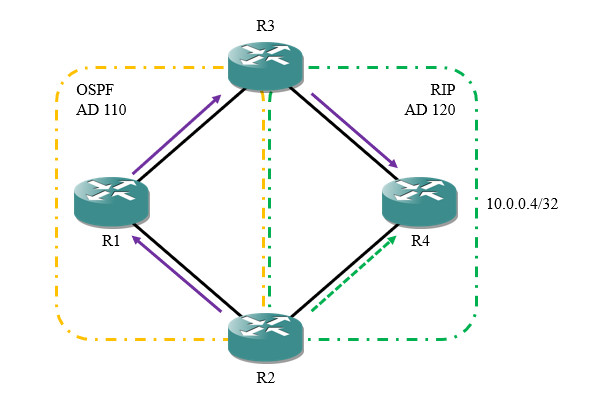

1.4.1  概述
中间系统到中间系统(Intermediate System to Intermediate System，IS-IS)协议是一种链路状态型内部网关协议。IS-IS协议原先由ISO制定(ISO 10589)，为OSI体系中的无连接网络服务(CLNS)设计，并不适用于IP网络；后来IETF对它进行扩展，使其适应IP网络，称为集成IS-IS(Integrated IS-IS)，相关标准由RFC 1195等文档进行规范。
IS-IS是电信运营商普遍采用的内部网关协议，因为它能够承载比OSPF协议更多的路由信息。集成IS-IS协议拥有以下特点：
 模块化设计，具有较强的扩展性，能够路由IPv4、IPv6、IPX等多种协议的数据包。
 报文结构简单，链路开销较低，邻居建立速度更快，能适应拓扑频繁变更的网络。
 设备硬件资源利用率更高，相比OSPF支持更大规模的网络。
1.4.2  术语
 无连接网络服务(CLNS)
ISO/OSI参考模型定义了无连接网络服务(Connectionless Network Service,CLNS)，允许设备在网络层进行无连接通信，类似于IP所提供的尽力而为服务；与CLNS对应的是面向连接网络服务(Connection Oriented Network Protocol,CONS)，可在网络层提供面向连接的服务。
CLNS体系包括CLNP、ES-IS和IS-IS三部分，其中终端系统(End System,ES)即主机，中间系统(Intermediate System)即网络层通信设备。
 CLNP
无连接网络协议(Connectionless Network Protocol,CLNP)是ISO/OSI模型的网络层数据报协议，与TCP/IP模型中的IP协议相似，提供网络层数据报传输服务。
 ES-IS
ES-IS是ISO/OSI模型中的终端系统与中间系统发现协议，功能类似于TCP/IP模型中的ARP、ICMP等协议，主机通过该协议配置前缀与网关信息。
 IS-IS
IS-IS是ISO/OSI模型中的路由协议，网络层设备使用该协议维护路由表。
 OSI路由级别
ISO/OSI模型根据所属范围定义了四种路由级别：
 Level 0：终端到网关的路由信息，由ES-IS协议实现。
 Level 1：区域内部的路由信息，由IS-IS协议实现。
 Level 2：区域之间的路由信息，由IS-IS协议实现。
 Level 3：自治系统之间的路由信息，由BGP协议实现。
 IS-IS区域
IS-IS协议维护Level 1和Level 2路由信息，根据路由器所维护的路由信息级别，分为Level 1路由器、Level 2路由器或Level 1/2路由器。Level 1路由器拥有区域内的拓扑信息； Level 2路由器维护区域间的路由信息；Level 1/2路由器作为区域的出口，是区域内部与外界交互的重要节点，它同时维护L1/L2两个LSDB。
一台路由器一般只属于一个区域，但链路的两端可以在不同区域内，因此IS-IS协议的区域分界点是链路而不是路由器。L1区域包括若干L1路由器与L1/2路由器；L2区域包括若干L2路由器，它们需要在物理上连续。IS-IS协议没有定义骨干区域，所有的L1/2路由器和L2路由器构成骨干网，负责将不同区域之间互联。

默认情况下Level 2区域的明细路由不会下发给Level 1区域，只会下发指向Level 1/2路由器的默认路由，但是Level 2区域可以获取Level 1区域的明细路由。IS-IS协议没有明确的将某个区域定义为骨干区域，由所有Level 2路由器和Level 1/2路由器组成骨干网，负责区域间的通信，骨干网必须是物理连续的。
我们可以使用命令全局更改路由器角色，也可以单独控制某个接口的角色：
 全局更改路由器角色
Cisco(config-router)#is-type [level-1|level-1-2|level-2-only]
 更改接口角色
Cisco(config-if)#isis circuit-type [level-1|level-1-2|level-2-only]

 网络服务接入点(NSAP)
网络服务接入点(Network Service Access Point,NSAP)是OSI模型的网络层编址系统，类似于TCP/IP协议栈中的IP地址，IS-IS协议使用NSAP地址作为设备标识，建立链路状态数据库。IP地址用于标识接口，而NSAP地址用于标识整个设备，每个设备最多可拥有256个NSAP地址。NSAP地址的长度可变，为8-20字节。
 

 AFI
组织格式标识符(Authority Format ID,AFI)取值范围为[0,99]，一般需要向管理机构申请，其中49为私有标识符，于RFC 1618中定义。
 IDI
初始域标识符(Initial Domain Identifier,IDI)用于在AFI下划分子域，可以为空，不为空时最多占用10字节。
 High-Order DSP
高位域指定部分，用于描述设备所属的区域。
 System ID
系统ID，在区域内唯一标识ES或IS设备，作用等同于路由器ID，通常设为设备MAC地址或使用路由器ID。
此处以"10.254.254.1"为例，将其转换为系统ID：
1.将每一组省略的0补齐：
  010.254.254.001
2.以4位数字为一组，重新分组：
  0102.5425.4001
不同区域的节点可以拥有相同的系统ID，但仍然建议使用全局唯一的系统ID。
 NSEL
NSEL(NSAP Selector)字段用于标识上层协议类型，取值为0时表示设备本身，这类地址称为网络实体名(Network Entity Titile,NET)。IS-IS协议无需上层协议介入，因此总是使用NET地址。为了支持平滑迁移，一个节点可配置多个NET地址。
AFI和IDI称为初始域部分(Initial Domain Part,IDP)，相当于IP中的网络ID；其它部分称为域内自定义部分(Domain Specific Part,DSP)，High-Order DSP相当于子网ID，系统ID相当于主机ID。
NSAP地址通常使用点分十六进制表示，一个合法的NSAP地址如下：
49.0001.0000.0000.0001.00
该地址表示域49、区域0001中编号为0001的节点。
 IS-IS进程
一台路由器可以运行多个独立的IS-IS协议进程，每个进程使用标签进行区分，标签只具有本地意义，可以为空字符串，也可以包含数字和字母。
 协议数据单元
协议数据单元(Protocol Data Unit,PDU)是IS-IS协议用于交互链路信息的报文，类似于OSPF中的LSA。
