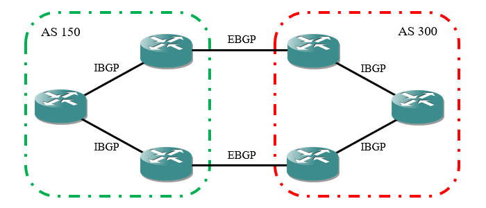
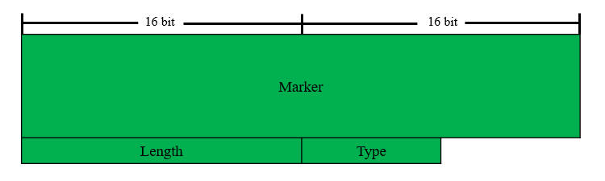
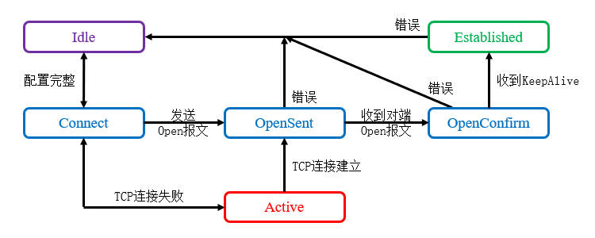

# 概述
边界网关协议(Border Gateway Protocol, BGP)是Internet所采用的自治系统(AS)间路由协议，能够承载大量的路由条目，并且提供了丰富的选路策略。

BGP是一种可靠的增强型距离矢量协议，基于TCP的179端口，采用单播增量更新的方式更新路由。与IGP协议不同，只要站点之间TCP可达，就可以建立BGP对等体关系，不一定要物理直连。

BGP协议在自治系统的角度传递路由信息，它的可靠性机制并不依赖于算法，而是协议自身定义的各种规则。

BGP协议适用于以下场景：

- 透传路由信息，其它AS之间可以穿过本AS相互通信，多用于运营商内部。
- 多运营商接入，且需要进行精确的选路控制。
- 本自治系统需要获取公网的明细路由。

以下场景则没有必要使用BGP协议：

- 单运营商源接入，此时使用默认路由即可。
- 多运营商接入，但仅实现冗余备份或负载均衡，此时没必要使用BGP协议。

BGP协议的当前版本是BGP 4，于1995年在RFC4271中定义，支持VLSM和CIDR，适用于现代的无类别网络环境。

# 术语
## 自治系统
自治系统(Autonomous Systems, AS)是指一组使用相同管理规则建立的网络。每个自治系统都有一个编号(AS Number, ASN)，用于唯一标识该自治系统。

早期ASN地址空间为16位，取值范围： `[0, 65535]` 。其中 `[0, 64511]` 为公有AS号，需要向IANA购买， `[64512, 65535]` 为私有AS号。后期ASN地址空间扩展到32位，取值范围： `[1, 4294967295]` 。

## BGP进程
BGP进程使用ASN进行标识，一台设备同时只能运行一个BGP进程。

## BGP发言人
发送BGP消息的路由器叫做BGP发言人(Speaker)。

## BGP对等体
相互交换BGP消息的路由器叫做BGP对等体(Peer)。

## IBGP
IBGP是指同一个AS内部的BGP邻接关系，路由信息管理距离较高，不如IGP可信。

## EBGP
EBGP是指不同AS之间的BGP邻接关系，通常运行EBGP的两个节点需要直连。

BGP的基本架构如下图所示：

<div align="center">



</div>

## 路由器ID
每个BGP路由器拥有全局唯一的ID，Open报文中含有发送方的路由器ID，可以自动选举，规则同OSPF的路由器ID，一般应当手动配置。

如果BGP会话已经建立，此时更改路由器ID只影响新建立的BGP会话。

## 属性
BGP给每条路由赋予很多不同的属性(Attribute)，使用这些属性来描述路由的优劣。

BGP协议也有Metric这一参数，但它只是影响选路的因素之一。

# 报文结构
BGP协议通过TCP协议的179端口建立会话并交互报文。BGP共有5种不同的报文，最长为4096字节，最短为19字节（只包含报文头），它们拥有相同的报文头部。

<div align="center">



</div>

🔷 Marker

用于校验BGP对等体的同步信息完整性，也用于报文认证，长度共16字节，不使用时所有比特均为1。

🔷 Length

BGP消息总长度（包括报文头部），以字节为单位。

🔷 Type

BGP消息类型，共有5个值，前四种消息是RFC 4271定义的，最后一种消息则是RFC 2918定义的。

<div align="center">

| 数值  |   报文类型   |
| :---: | :----------: |
|   1   |     Open     |
|   2   |    Update    |
|   3   | Notification |
|   4   |  KeepAlive   |
|   5   |   Refresh    |

</div>

# 报文类型
## Open
Open报文用于建立邻接关系，BGP只能单播发送此报文，所以必须手动指定邻居。

Open报文的详细字段如下文所示：

🔷 Version

协议版本号，长度1字节。

当前常用的BGP版本号为"4"。

🔷 My AS

报文发送方的ASN，长度2字节。

若使用4字节的ASN，该字段取值恒为23456，真实的ASN包含在可选参数中。

🔷 Hold Time

发送方的Hold Time值，长度2字节。

用于协商BGP对等体之间发送Keepalive或Update等报文的时间间隔。收到对等体的Open报文后，路由器将本地设置的Hold Time与其作比较，以较小的值为基准。

 BGP Identifier
报文发送方的Router ID，共4字节。
 Opt Parm Len
可选参数的长度，共1字节，该数值的单位为字节。
 Optional Paramters
可选参数列表，每个可选参数都是TLV单元，在RFC 3392中有描述。其中常用的是类型2，描述了设备支持的协议簇与特性。
 KeepAlive
KeepAlive用于保持对等体之间的TCP会话，只有BGP报文头部，报文总长度恒为19字节，默认发送周期为60秒。
 Update
Update报文用于向BGP对等体通告路由信息变化。BGP采用增量更新机制，更新报文中包含两个部分：新增与撤销的路由信息，新增的路由信息包含在Path Attribute字段中，包括路由条目的前缀与详细属性；撤销的路由信息包含在Withdrawn Routes字段中。
 Notification
Notification报文用于发送警告消息，内容在RFC 4271中定义，出现此报文时双方会重置邻接关系。
 Error Code
错误代码，共1字节，未知错误用零表示。
 Error subcode
细节代码，共1字节，未知错误用零表示。
 Data
错误详细信息。
 Refresh
当路由策略发生变更时，节点用Refresh报文通知对等体，立即更新它们的路由表。此报文是后期的补充标准，不支持路由刷新能力的节点将不予理会。

# 计时器
## 邻接关系计时器
BGP的Open报文中有Hold Time字段，默认值为180秒，节点将此数值与自身配置相比较，选择其中较小的一个作为Hold-Down计时器。
Keepalive计时器默认为Hold-Down计时器的1/3，每隔60秒向对等体发送一个Keepalive报文，当连续有三个Keepalive报文丢失时，Hold-Down计时器满，邻接关系重置。
如果需要修改所有邻接关系计时器，可以在BGP进程中全局修改：
Cisco(config-router)#timers bgp [Keepalive Time] [Hold-Down Time]
也可以对特定的邻居进行修改：
Cisco(config-router)#neighbor [邻居IP地址] timers [Keepalive Time] [Hold-Down Time]

## 路由通告计时器
路由通告计时器用于控制路由更新发送的间隔，每个周期内路由变更信息会先累积起来，计时器满时一并发送。在EBGP对等体之间，该计时器默认为60秒；在IBGP对等体之间，该计时器为0秒，即有变化时立即发送。
我们可以更改对于指定邻居的通告间隔：
Cisco(config-router)#neighbor [邻居IP地址] advertisement-interval [间隔/秒]


# 邻接关系状态机
🔷 Idle

路由器尝试与目标地址建立连接，如果目标地址不可达，将会持续处于Idle状态。

当我们使用环回接口建立EBGP邻居时，如果忘记配置静态路由、更新源地址、TTL值，将会导致IP不可达，邻接关系停留在Idle状态。

🔷 Connect

尝试建立TCP连接并启用重连计时器，若TCP连接成功，发送Open报文后进入Open-Sent状态；若重连计时器超时后仍未建立连接，进入Active状态。

🔷 Active

邻居可达但无法建立TCP连接时，处于Active状态，此时会持续尝试建立TCP会话。

🔷 Open-Sent

TCP连接建立成功并发送Open报文之后，进入此状态。

🔷 Open-Confirm

本端收到对等体对Open的确认报文后，进入此状态，直到收到对方的Keepalive报文后转为Established状态。

🔷 Established

BGP邻居关系已建立，此时对等体可以发送Update报文进行路由更新。

# 工作流程
## 建立邻接关系
BGP邻居关系建立过程较为简单，当两端建立TCP会话后，互相发送Open报文，双方将收到的Open报文与本地设置的参数对比，协商支持的特性与计时器数值。

<div align="center">



</div>

图 5-57 BGP邻接关系状态机
BGP是运行在Internet上的路由协议，不能使用组播或广播方式自动发现邻居，需要使用命令人工配置，本地AS号与远程AS号一致时为IBGP邻居，否则为EBGP邻居。
Cisco(config-router)#neighbor [邻居IP地址] remote-as [远程AS号]
使用以下命令可以查看邻接关系的摘要与详细信息：
 
图 5-58 BGP邻居概要信息
 
图 5-59 BGP邻居详细信息
在邻居详细信息中，Neighbor Capabilities即为双方协商后启用的特性。
 重置邻接关系
BGP可以临时关闭和某个对等体的连接，而不必删除相关配置，此功能常用于调试。
Cisco(config-router)#neighbor [邻居IP地址] shutdown
使用Clear命令可以重置BGP邻接关系：
Cisco#clear ip bgp [邻居IP地址|*] {soft}
此处填写"*"时表示重置所有的邻接关系，填写具体地址时只重置该邻接关系。
如果添加"soft"参数，则发送Refresh报文通知对方刷新路由表，不重置邻接关系。
 使用环回接口建立邻接关系
除了通过直连接口建立邻接关系外，我们通常使用环回接口，只要还有物理链路可以到达对端环回接口，邻居关系就不会失效，拥有多条物理路径时可以提高可靠性。
路由器默认将出站接口地址作为数据包的源地址，使用环回接口时，要将BGP报文的源地址改为环回接口地址，否则对方接收后会将这些数据包丢弃。
Cisco(config-router)#neighbor [邻居IP地址] update-source [本地端口ID]
默认情况下，本地发送给EBGP对等体的Open报文TTL值为1，使用环回接口时需要增加一跳，否则这些数据包会因为TTL耗尽无法到达对端。
Cisco(config-router)#neighbor [邻居IP地址] ebgp-multihop [TTL]


# 认证
BGP协议可以使用TCP的MD5认证功能，并且支持认证的不间断服务。

我们需要在链路两端的路由器上配置相同的密钥：

```text
Cisco(config-router)# neighbor <邻居IP地址> password <认证密钥>
```
