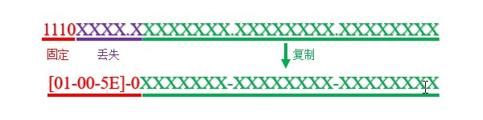

# 概述（TODO）
组播是一种点对多点的通信方式，在组播通信系统中，源主机向组播组地址发送一份报文，所有属于该组的成员都会收到该消息，其它无关节点则不受干扰。

使用单播进行一对多通信时，源主机向接收者逐个发送报文，这会占用大量的资源，如果接收者身份经常变化，则根本无法实现。使用广播进行一对多通信时，可以解决接收者位置不确定的问题，但其他节点也要拆包，造成性能的浪费。组播恰好能够解决上述问题，实现高效的一对多通信。

组播通信系统需要一系列协议的支持，IGMP/MLD负责管理末端网络的组播组注册工作；IGMP Snooping/CGMP负责在末端网络实现链路层按需播送，PIM协议负责传递组播路由信息；MSDP/MBGP负责处理跨域的组播流量。

# 术语
## 组播组
组播组是若干主机的集合，使用组播地址作为标识，主机加入某个组后，就开始监听发往该组地址的报文。

## 组播组成员
所有加入组播组的主机都是该组成员，它们可能集中于某个网络，也可能广泛分布在不同网络中。组成员是动态变化的，可以随时加入或离开某个组。

## 组播源
发送组播报文的主机即组播源，多个组播源可以向同一个组播组发送报文。

## 组播路由器
能够路由组播报文的设备称为组播路由器，其中组播源所在网络的路由器称为第一跳路由器(FH)，负责将组播报文引入路由域；接收者所在网络的路由器称为最后一跳路由器(LH)，负责管理末端网络的组播组。

# IPv4组播地址映射
以太网交换机转发组播报文时，需要将组播IP映射成MAC地址。IPv4对应的组播MAC地址OUI固定为"01-00-5E"，第25位固定为"0"，剩余23位对应组播IP地址的低23位。

由于组播IP地址中的第5至9位信息丢失，导致32个IP地址被映射到同一个MAC地址，所以我们部署组播业务时，应避免使用容易混淆的地址。

# IPv6组播地址映射
IPv6对应的组播MAC地址前16位固定为"33-33"，将IPv6组播地址的低32位复制到"33-33"后部，即可组成组播MAC地址。例如："FF02::1"对应的组播MAC地址为"33-33-00-00-00-01"。IPv6中每个组播MAC地址对应的IP地址数量更多，部署业务时需要留意。

二层交换机收到组播报文后，默认按照广播方式播送。交换机按照帧的源地址生成转发表项，然而组播地址只能作为目的地址，不能被交换机自动学习，如果要在数据链路层实现按需播送，还需配置IGMP Snooping/CGMP。

# 组播服务模型
## ASM
任意源组播(Any-Source Multicast, ASM)对组播源没有要求，任何节点都可以向组播组发送报文，是默认的组播模型。

## SFM
源过滤组播(Source-Filtered Multicast, SFM)与ASM类似，但增强了安全性，路由器可以对组播源进行过滤，允许或禁止特定组播源的报文通过。

## SSM
特定源组播(Source-Specific Multicast, SSM)允许接收者选择特定的组播源，此方式要求接收者事先通过某种方式知晓组播源的身份。SSM业务一般使用"232.0.0.0"-"232.255.255.255"范围内的地址。

# 组播路由表
在Cisco设备上使用"show ip mroute"命令可查看组播路由表。

组播路由表项的格式为"(S,G)"，S表示源地址，G表示组播组，若S为"*"，表示任意源。除此之外，每个表项还包括入站接口和出站接口列表等信息。

<!-- TODO
    • 启用/禁用组播路由功能
Cisco(config)#{no} ip multicast-routing
Cisco(config)#{no} ipv6 multicast-routing
 -->