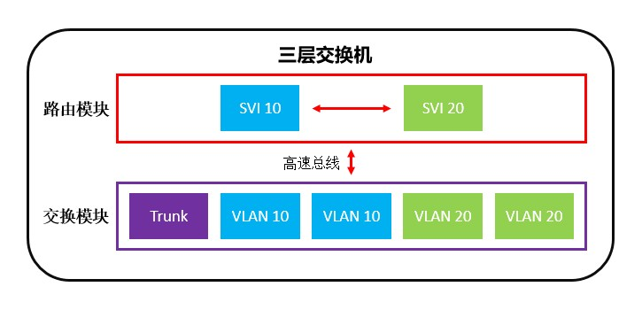

# 概述
三层交换机是具有部分网络层功能的交换机，它工作在OSI参考模型的第三层。三层交换机最重要的功能是加快大型局域网内部的数据交换，其路由能力也是为这一目的服务的，因此路由功能较为单一，不适合连接异构网络。

三层交换机执行数据包转发等动作时，可使用专用芯片完成，而路由信息更新、路由表维护、路由计算等功能，则需要由软件实现。

# 术语
## 交换虚拟接口
交换虚拟接口(Switch Virtual Interface, SVI)是三层交换机用于实现VLAN间路由的逻辑接口，当我们为VLAN创建SVI接口并配置IP地址后，对应的网段就会加入路由表，VLAN中的主机可以使用SVI接口作为网关与外界通信。SVI接口在网络层连通VLAN与外部网络，因此人们也把它称为三层逻辑接口。

SVI接口具有路由器接口的基本特性，比如：拥有独立的MAC地址、能够配置IP地址、支持部分网络层协议（例如：路由协议）。同一台设备上每个VLAN最多可配置一个SVI接口。

通常交换机的默认VLAN(VLAN 1)自带SVI且不能被删除，它的作用是对设备进行远程管理，如果我们不用VLAN 1作为管理VLAN，可以将它的SVI设为关闭。

二层交换机的VLAN也可以拥有SVI接口，但整机只能同时启用一个SVI接口，如果我们开启新VLAN的SVI，上一个活跃的SVI将会自动关闭。这是厂家根据设备功能定位与硬件性能所做出的限制，二层交换机的SVI只能接入管理VLAN便于管理员进行远程控制。

SVI接口状态为“启用”时才能正常工作，需要满足以下条件：

- 对应的VLAN必须存在。
- 对应的VLAN中至少有一个物理端口状态为“启用”，或设备上有至少一个Trunk接口状态为“启用”。
- SVI接口的管理状态为“启用”。

# 工作流程
三层交换机的路由表相当于路由表和ARP表的组合，能够实现高速交换，这种路由表的生成方式主要有两种：

## 按需生成
当有新的流量传入时，交换机首先读取IP数据包头部的目的地址，将第一个数据包进行路由，同时记住目的端口；后续相同的流量就可以直接转发到相应端口，没有必要将每个数据包都进行路由，这就是所谓的“一次路由，多次交换”。当长时间没有数据刷新表项后，该表项将被删除。

## 预先生成
有些交换机只要学习到ARP条目，就会自动生成主机路由，并保持主机路由与ARP条目之间的同步。

按此方式工作的设备相对第一种较少，因为这种方式对硬件资源的消耗较大；它的优点是第一个数据包就能直接进行交换，转发性能略高。

# 基本应用
<!-- TODO

 3.2.3   配置方法
                • 基本配置
    • 创建/删除SVI
Cisco(config)#{no} int vlan [VLAN ID]
    • 开启/关闭SVI
Cisco(config)#int vlan [VLAN ID]
Cisco(config-if)#{no} shutdown
    • 给SVI配置IP地址
Cisco(config)#int vlan [VLAN ID]
Cisco(config-if)#ip address [IP地址] [子网掩码]  

# 构建三层链路
三层交换机的接口不仅可以工作在数据链路层，还可以工作在网络层，通过三层链路与路由器、防火墙等设备互联。
                • 典型方式
大多数三层交换机可以将端口切换为三层模式，此时端口具有路由器接口的功能：
    • 将端口切换为三层模式
Cisco(config-if)#no switchport
    • 将端口切换为二层模式
Cisco(config-if)#switchport
                • 非典型方式
部分三层交换机不支持直接将物理端口切换为三层模式，此时我们可以创建一个专门的VLAN，把端口划入其中，然后通过SVI实现网络层功能。
1.创建VLAN：
Cisco(config)#vlan [VLAN ID]
Cisco(config-vlan)#exit
2.分配物理接口：
Cisco(config)#int [端口ID]
Cisco(config-if)#switchport mode access
Cisco(config-if)#switchport access vlan [VLAN ID]
Cisco(config-if)#exit
3.创建SVI并进行网络层配置：
Cisco(config)#int vlan [VLAN ID]
Cisco(config-if)#ip address [IP地址] [子网掩码]
Cisco(config)#exit

-->
